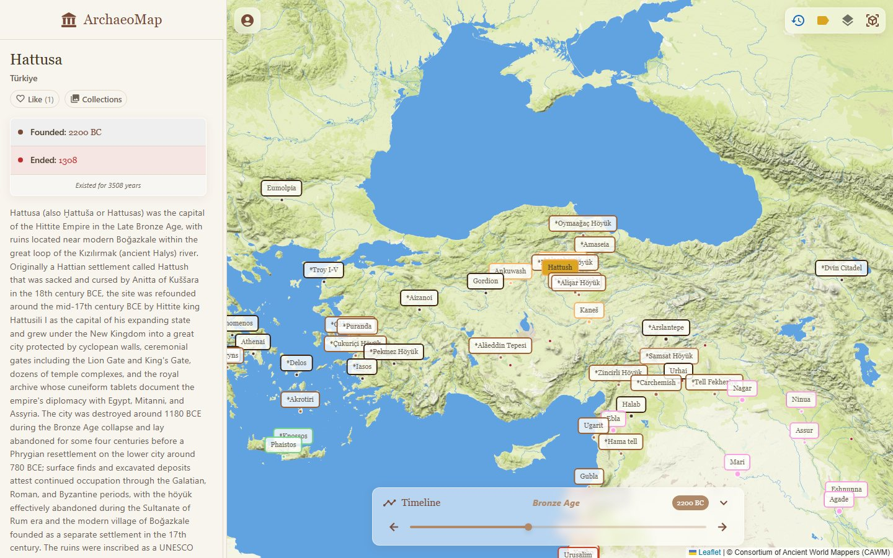

# ArchaeoMap

An interactive historical map of ancient cities. Drag the timeline and watch settlements appear, change names and rulers, and disappear, from the Bronze Age to today.

**Live site: [archaeomap.com](https://archaeomap.com)**

[](https://archaeomap.com/cities/turkiye/hattusa)

This repository is the frontend. The REST API (Node.js, Express, MongoDB) lives in a separate repository and is served from `api.archaeomap.com`.

## Features

- 2D map and 3D globe sharing the same base layers, including an ancient-world map from the Consortium of Ancient World Mappers
- Timeline slider that filters cities by year and shows the name each city had at that time
- City pages with history, rulers, landmarks and population, each with its own URL, e.g. [/cities/turkiye/hattusa](https://archaeomap.com/cities/turkiye/hattusa)
- Member panel: likes, collections, city submissions and a moderation workflow
- Plain-text and HTML city indexes for crawlers that do not run JavaScript ([llms.txt](https://archaeomap.com/llms.txt), [cities-index.html](https://archaeomap.com/cities-index.html))

## Stack

- React 19, React Router 7
- Vite 6
- Leaflet (react-leaflet) for the 2D map, Cesium (resium) for the 3D globe
- MUI 7 with Emotion
- axios, date-fns
- Cloudflare Pages for hosting, with Pages Functions proxying the sitemap, city indexes and map tiles to the API

## Running locally

Requires Node.js 20 or newer.

```bash
npm install
npm start        # dev server on http://localhost:3000
npm run build    # production build into build/
```

The app calls the API at `VITE_API_URL`, which defaults to `http://localhost:5000/api`. Set it in a local `.env` file to use a different address. The production API only accepts requests from archaeomap.com, so local development needs a locally running backend.
